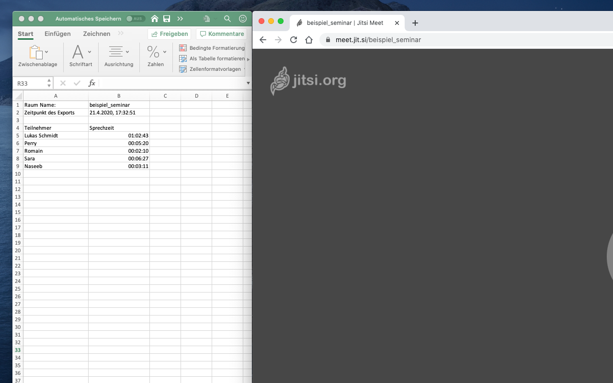

# Jitsi speaker stats exporter

This extension for Google Chrome exports the speaker statistics of an open jitsi room as a CSV file.

## Download on the Google Chrome Web Store

The extension has been submitted for the Chrome Web Store but is currently in the audit state. I'll add a link here as soon as it's been published.

## Why the application was created

The extension was created because a friend's organization provides voluntary web seminars for old people. The organization needs to prove this to the sponsors. It's a German organization.

## Limitations

- This extension only works on https://meet.jit.si right now. There is an [open issue](https://github.com/Robert-Beier/jitsi-speaker-stats-exporter/issues/5) for detecting a jitsi application independent from the domain.
- Currently, the extension is only available in German 🇩🇪 translation. There is an [open issue](https://github.com/Robert-Beier/jitsi-speaker-stats-exporter/issues/3) for adding localization.

## 3rd party licenses

An icon from the [material icons](https://material.io/resources/icons) was modified and used as the logo for this application. Material icons are licensed under apache [license version 2.0](https://www.apache.org/licenses/LICENSE-2.0.html).
